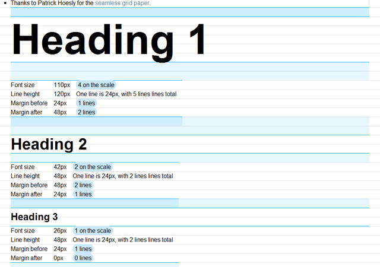

###### Front-End Develop SCHOOL

# DAY 10

### 진행 내용

- CSS 배경 속성
- CSS 레이아웃 속성
- CSS 리스트 속성
- CSS 테이블 속성

-

### Float

- Float 속성 정리
- Float이 문서 흐름에 미치는 영향
- clear 속성
- Float이 적용된 요소를 감싸는 부모 요소 높이 설정 방법
- Float & Overflow;

-

### Vertical Rhythm

- Headings
- Paragraph
- Lists
- Table



-

###float된 하위요소에 대처하는 상위요소의 자세

```html
<div class="parent">
	<div class="child">Child Element 1</div>
	<div class="child">Child Element 2</div>
	<div class="child">Child Element 3</div>
</div>
<div class="parent">
	<div class="child">Child Element 1</div>
	<div class="child">Child Element 2</div>
	<div class="child">Child Element 3</div>
</div>
<div class="parent">
	<div class="child">Child Element 1</div>
	<div class="child">Child Element 2</div>
	<div class="child">Child Element 3</div>
</div>
```
```css
.parent {
	padding: 1rem;
	border: 1px solid #eceded;
	margin-bottom: 2rem
	background: #efefef;
}
.child {
	/* 자식요소들에게 float 적용 */
	/* 이 때 계단현상이 생겨 깨진다 */
	float: left;
	width: 140px;
	height: 100px;
	text-align: center;
	line-height: 100px;
	color: #fff;
}
.child:first-child { background: #3c1323; }
.child:nth-child(2) { background: #1c4e36; }
.child:nth-child(3) { background: #15143d; }
```

####1. 부모 요소도 띄워라
```css
.parent {
	float: left;
	...
}
```

 - 하지만 이방식은 무한 float에 빠지는 치명적인 결함이 있다. 또한 가운데 정렬도 불가능해진다

####2. 새로운 요소로 클리어 하라

```html
<div class="parent">
	<div class="child">Child Element 1</div>
	<div class="child">Child Element 2</div>
	<div class="child">Child Element 3</div>
	<div class="clear"></div>
</div>
```
```css
.clear {
	clear: both;
}
```

 - 마지막 하위 요소가 clear 속성을 가지게 되면 상위 요소가 나머지 하위 요소들을 자식으로 감싸게 된다.
 - 이 방식은 무의미한 요소를 추가하게 되어 좋은 구현이라 하기 어렵다.

####3. overflow 속성값을 hidden 또는 auto로

```css
.float-container {
	overflow: hidden;
	overflow: auto;
}
```

 - 많이 쓰이는 코드이나 권장하지 않는다.
 - 문제사항을 수반한 해결방법이다.

####4. ::after 가상요소를 이용하라(.clearfix)

```css
.clearfix::after {
	clear: both;
	display: block;
	content: '';
}
```

 - 최적의 방식
 - 오페라 브라우저의 버그가 있어 개선된 방식이 존재한다

```css
.clearfix::before,
.clearfix::after {
	content: '';
	display: table;
}
.clearfix::after {
	clear: both;
}
/* 다만 이해하기 난해한 코드가 될 수 있다 */
```

-

####기타: 이미지 하단에 공백을 형성하여 옆으로 배치되는 글들이 동일한 공간을 가질 수 있도록 설정
```css
.blank-bottom-img img + *,
img.blank-bottom + * {
	overflow: hidden;
}
```

-

### 기타/참고

- [A new micro clearfix hack](http://nicolasgallagher.com/micro-clearfix-hack/)
- [Force Element To Self-Clear its Children](https://css-tricks.com/snippets/css/clear-fix/)
- [CSS 레이아웃을 배웁시다](http://ko.learnlayout.com/toc.html)
- [All About Floats](https://css-tricks.com/all-about-floats/)
- [CSS: Clearing Floats with Overflow](http://webdesignerwall.com/tutorials/css-clearing-floats-with-overflow) [#](http://firejune.com/1653/Float+%EC%86%8D%EC%84%B1%EC%9D%98+%EB%86%92%EC%9D%B4+%EB%AC%B8%EC%A0%9C%EB%A5%BC+Overflow%EB%A1%9C+%ED%95%B4%EA%B2%B0%ED%95%98%EB%8A%94+%EB%B0%A9%EB%B2%95)
- [lucy](http://lucy.29cm.co.kr/hello)
- [conference](http://themes-pixeden.com/landing/conference/home3.html#home)
