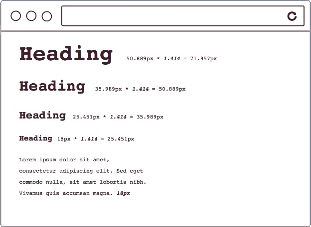
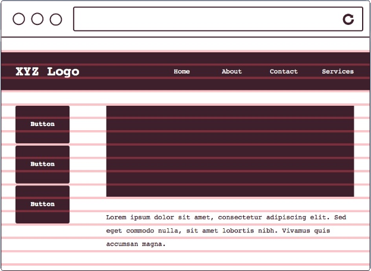

###### Front-End Develop SCHOOL

# DAY 12

### 타이포그래피 시스템 (Typography System)

비주얼 디자인 원칙에 따른 타이포그래피를 설계(Design)함을 말한다.

#### 모듈러 스케일(Modular Scale)

**모듈러 스케일이란?** 관계된 객체 간에 개별적으로 일정한 배율(Ratio)이 반영된 수의 나열이다.



##### 타입 스케일 배율(Type Scale Ratio)

- `1.067` — Minor Second
- `1.125` — Major Second
- `1.200` — Minor Third
- `1.250` — Major Third
- `1.333` — Perfect Fourth
- `1.414` — Augmented Fourth
- `1.500` — Perfect Fifth
- `1.600` — Minor Sixth
- `1.618` — Golden Ratio (황금 비율)
- `1.667` — Major Sixth
- `1.778` — Minor Seventh
- `1.875` — Major Seventh
- `2.000` — Octave
- `2.500` — Major Tenth

-

#### 베이스라인(Baseline)

베이스라인이란? 행(Row) 사이 간격으로 글자 크기(Font Size)를 포함하는 높이를 말한다.



-

#### 버터컬 리듬(Vertical Rhythm)

버티컬 리듬이란? 각 요소(Elements) 간의 수직적인 공간 배열 관계를 말한다.


-

### CSS 타이포그래피 시스템 & 모듈러 스케일

**모듈러 스케일** & **베이스라인** & **버티컬 리듬**이 반영된 타이포그래피 시스템


Typography System 제작 결과물


-

##### 본문 디자인

```css
/**
 * 본문 디자인(설계)
 * ---------------------------------------------
 * 글자 모양(Font Family): Spoqa Han Sans (Like Noto Sans)
 * 글자 색상(Color): #373737
 * 글자 크기(Font Size): 16px
 * 행간 비율(Line Height): 1.5 (16 x 1.5 = 24px)
 * 자간 설정(Letter Spacing): -25
 */
body {
 margin-bottom:  1.5em;
 font-family:    "Spoqa Han Sans";
 font-size:      16px;
 line-height:    1.5;
 letter-spacing: -0.025em; /* em = Equal M */
 color:          #373737;
}
```

-

##### 모듈러 스케일을 반영한 제목 글자 디자인(크기/행간/마진)

> 폰트크기(font-size): 이전 폰트크기(previous-font-size) × 타입배율(type-scale)

```css
/**
 * 제목 디자인
 * h1~6
 * ---------------------------------------------
 * 글자 크기 배율(Type Scale): x1.24
 * 본문 기본 글자 크기(Base Font Size): 16px = 1em
 * ※ 소수점은 4자리까지 끊고 절삭.
 * ------------------------------------------- */
h6 { font-size: 1.24em;   } /* x1.24 */
h5 { font-size: 1.5376em; } /* x1.24 */
h4 { font-size: 1.9066em; } /* x1.24 */
h3 { font-size: 2.3642em; } /* x1.24 */
h2 { font-size: 2.9316em; } /* x1.24 */
h1 { font-size: 3.6352em; } /* x1.24 */
```

-

##### 행간 설정 공식

> 글자 크기에 따라 차지하는 행의 개수 = ceil( 글자 크기 비율(font-size) ÷ 기본 행간 비율(base-line-height) )<br>
> ※ ceil()은 올림 함수

> 행간 비율(line-height) = 행의 개수 × ( 기본 행간 비율(base-line-height) ÷ 글자 크기 비율(font-size) )

```css
/*
[ line-height을 구하는 공식 ]
1) ceil( 글자 크기 비율(1.24) ÷ 기본 행간 비율(1.5) ) = 글자 크기가 차지하는 행의 개수
   1.24/1.5 = .826666667 => 1개
2) 기본 행간 비율(1.5) ÷ 글자 크기 비율(1.24) × 행의 개수
   1.5/1.24 = 1.209677419 * 1
*/
```

```css
h6 {
  font-size: 1.24em;
  line-height: 1.2096; /* 아래 정의된 line-height에 의해 무효화 됨. */
  /* ※ 행간을 소수점 3번째 자리까지 쓰되 올림 (다소 어긋난 높이 조정) */
  line-height: 1.21;
}
```

-

##### 마진 설정 공식

> 기본 행간 비율(1.5) ÷ 글자 크기 비율(1.24)<br>
> ※ 소수점 4자리에서 끊고 절삭.

```css
h6 {
  font-size: 1.24em;
  line-height: 1.21;
  /*
  [ margin-bottom을 구하는 공식 ]
  기본 행간 비율(1.5) ÷ 글자 크기 비율(1.24)
  1.5/1.24 = 1.209677419
  */
  margin-bottom: 1.2096em;
}
```

-

### 버티컬 리듬이 반영된 타이포그래피 코드 전문

```css
/**
 * 본문 디자인(설계)
 * ---------------------------------------------
 * 글자 모양(Font Family): Spoqa Han Sans (Like Noto Sans)
 * 글자 색상(Color): #373737
 * 글자 크기(Font Size): 16px
 * 행간 비율(Line Height): 1.5 (16 x 1.5 = 24px)
 * 자간 설정(Letter Spacing): -25
 */
p {
  margin-bottom:  1.5em;
  font-family:    "Spoqa Han Sans";
  color:          #373737;
  font-size:      16px;
  line-height:    1.5;
  letter-spacing: -0.025em; /* Equal M */
}

/**
 * --------------------------------
 * 제목 디자인
 * h1~6
 *
 * Type Scale: x1.24
 * Base Font Size: 16px = 1em
 * ----------------------------- */
h6 {
  font-size: 1.24em;
  /*
  [ line-height을 구하는 공식 ]
  1) ceil( 글자 크기 비율(1.24) ÷ 행간 비율(1.5) ) = 글자 크기가 차지하는 행의 개수
     1.24/1.5 = .826666667 => 1개
  2) 행간 비율(1.5) ÷ 글자 크기 비율(1.24) × 행의 개수
     1.5/1.24 = 1.209677419 * 1
  */
  line-height: 1.2096;
  line-height: 1.21; /* ※ 행간을 소수점 3번째 자리까지 쓰되 올림 (다소 어긋난 높이 조정) */
  /*
  [ margin-bottom을 구하는 공식 ]
  행간 비율(1.5) ÷ 글자 크기 비율(1.24)
  1.5/1.24 = 1.209677419
  */
  margin-bottom: 1.2096em;
}
h5 {
  font-size: 1.5376em;
  line-height: 1.951; /* 행의 개수(2) × 0.9755  */
  line-height: 1.96;
  margin-bottom: 0.9755em; /* 1.5/1.5376 = 0.9755 */
}
h4 {
  font-size: 1.9066em;
  line-height: 1.5734; /* 행의 개수(2) × 0.7867 = 1.5734  */
  line-height: 1.58;
  margin-bottom: 0.7867em; /* 1.5/1.9066 = 0.7867 */
}
h3 {
  font-size: 2.3642em;
  line-height: 1.2688; /* 행의 개수(2) × 0.6344 = 1.2688 */
  line-height: 1.27;
  margin-bottom: 0.6344em; /* 1.5/2.3642 = 0.6344 */
}
h2 {
  font-size: 2.9316em;
  line-height: 1.5348; /* 행의 개수(3) × 0.5116 = 1.5348 */
  line-height: 1.54;
  margin-bottom: 0.5116em; /* 1.5/2.9316 = 0.5116 */
}
h1 {
  font-size: 3.6352em;
  line-height: 1.2378; /* 행의 개수(3) × 0.4126 = 1.2378 */
  line-height: 1.24;
  margin-bottom: 0.4126em; /* 1.5/3.6352 = 0.4126 */
}
```

-

### 재사용 가능한 제목 클래스 속성 설정

[미터법 접두사(Metric Prefix)](https://en.wikipedia.org/wiki/Metric_prefix)

```css
h1, .exa {
  font-size: 3.6352em;
  line-height: 1.24;
  margin-bottom: 0.4126em;
}

⋮

h6, .kilo {
  font-size: 1.24em;
  line-height: 1.21;
  margin-bottom: 1.2096em;
}
```

-

##### 크기 범주를 넓히는 클래스 추가 (HTML 제목 6단계 한계 극복!)

```css
.yotta {
  font-size: 2.2807em;
}

.zetta {
  font-size: 2.0273em;
}

⋮

small, .milli {
  font-size: 0.8889em;
}

.micro {
  font-size: 0.7901em;
}
```

---

###Position

 - `static` :
  - default. 모든 요소의 기본값
 - `relative` :
  - 원래 위치에서 상대적, 주는 속성(top, left, right, bottom)에 따라 이동
  - 일반 흐름(normal flow)에 영향을 주지 않는다
 - `absolute` :
  - offsetParent
  - 부모 위치에서 상대적, relative 처럼 속성에 따라 이동
  - 부모 요소는 자격이 필요하다. position 값이 static이 아니고 가장 가까운 요소를 찾는다.
  - 일반 흐름(normal flow)에 영향을 준다
  - display 값이 block으로 변경된다.
  - 일반적으로 `absolute`의 부모에 `relative`를 주는 이유는 일반흐름을 깨지 않기 때문이다.
  - `float`의 경우 부모요소가 float된 요소를 감쌀 수 있는 방법이 있으나, `absolute`는 height를 지정하여야 한다.
 - `fixed` :
  - `absolute`와 유사하게 처리되나 결과는 다르다
  - 고정형태로 위치가 설정된다. 화면 스크롤과 상관 없이 항상 그 자리르 유지한다.

 - `z-index` :
  - z-index속성은 반드시 position 속성(static 제외)과 함께 사용된다.
  - `z-index` 속성값은 양의 정수, 0, 음의 정수 사용가능
  - 1단위가 아닌 10 또는 100단위로 사용하는 것이 유지보수 관점에서 권장된다

####박스 센터 포지셔닝 Centering(Vertical, Horizontal)

```css
.box {
  position: absolute;
  top: 50%;
  left: 50%;
  transform: translate(-50%, -50%);
  /* MS IE 9 */
  -ms-transform: translate(-50%, -50%);
  /* Mobile Default Android Browser 50- */
  -webkit-transform: translate(-50%, -50%);
  transform: translate(-50%, -50%);
}
```

####그림자 효과 Shadow Effect

```css
/* box-shadow: [inset] x y blur spread color; */
box-shadow: 0 6px 5px #eaeaea; /* 그림자가 바깥쪽 방향으로 생김 */
box-shadow: inset 0 6px 5px #eaeaea; /* 그림자가 안쪽 방향으로 생김 */

/* text-shadow: x y blur spread color; */
text-shadow: 0 2px 1px #828282;
```

---

###상단/하단 바 고정 포지션

```html
<div id="page-header-bar"><h4>Header bar</h4></div>
<main>
  <h1>Lorem ipsum dolor sit amet.</h1>
  <h1>Lorem ipsum dolor sit amet.</h1>
</main>
<div id="page-footer-bar"><h4>Footer bar</h4></div>
```
```css
/* 멀티 배경 이미지 삽입(Multibackground). IE 9+ */

body {
  background:
    linear-gradient(45deg, hsla(0,50%,0%,0.3) 50% transparent 50%),
    url(" ... "),
    url(" ... ") no-repeat center;
  background-size:
    5px 5px,
    40px auto,
    cover;
}

#page-header-bar {
  position: fixed;
  width: 100%;
  text-align: center;
}
```

---

### 모듈러 타이포그래피 도구

- [Typografier](http://typografier.web-dev.tools/)
- [type-scale](http://type-scale.com/)
- [modularscale](http://www.modularscale.com/)
- [gridlover](http://www.gridlover.net/)
- [Type Anatomy](https://www.supremo.tv/typeterms/)
- [Kerning Game](http://type.method.ac/)

-

### 기타/참고

- [A More Modern Scale for Web Typography](http://typecast.com/blog/a-more-modern-scale-for-web-typography)
- [How To Use Size, Scale, And Proportion In Web Design](http://vanseodesign.com/web-design/size-scale-proportion/)